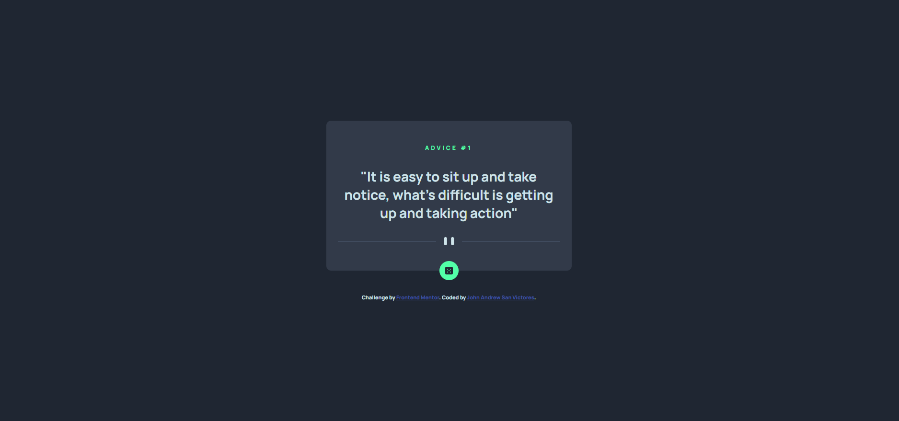

# Frontend Mentor - Advice generator app solution

This is a solution to the [Advice generator app challenge on Frontend Mentor](https://www.frontendmentor.io/challenges/advice-generator-app-QdUG-13db). Frontend Mentor challenges help you improve your coding skills by building realistic projects.

## Table of contents

- [Overview](#overview)
  - [The challenge](#the-challenge)
  - [Screenshot](#screenshot)
  - [Links](#links)
- [My process](#my-process)
  - [Built with](#built-with)
- [Author](#author)

**Note: Delete this note and update the table of contents based on what sections you keep.**

## Overview

### The challenge

Users should be able to:

- View the optimal layout for the app depending on their device's screen size
- See hover states for all interactive elements on the page
- Generate a new piece of advice by clicking the dice icon

### Screenshot

### Links

- Solution URL: [https://github.com/frontend-mento/advice-generator-app](https://github.com/frontend-mento/advice-generator-app)
- Live Site URL: [https://frontend-mento.github.io/advice-generator-app](https://frontend-mento.github.io/advice-generator-app)

## My Process

### Built with

- Semantic HTML5 markup
- CSS custom properties
- Flexbox
- CSS Grid
- Mobile-first workflow

## Author

- Website - [John Andrew San Victores](https://frontend-mento.github.io/advice-generator-app)
- Frontend Mentor - [@johnandrewsanvictores](https://www.frontendmentor.io/profile/johnandrewsanvictores)
- Github - [@johnandrewsanvictores](https://github.com/johnandrewsanvictores)
